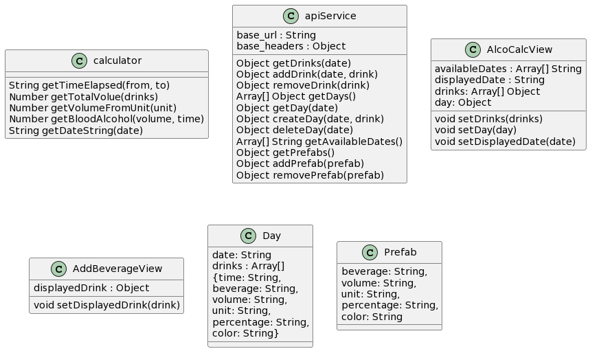
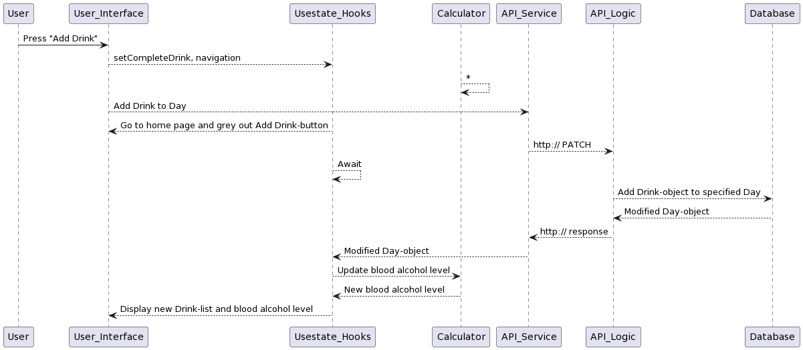
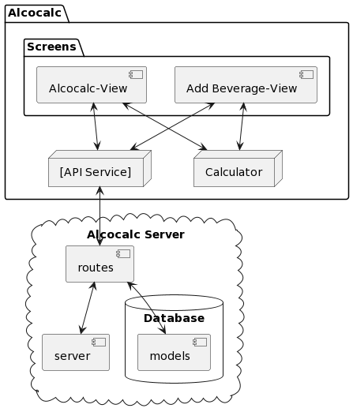

# AlcoCalc - gr2245
## Release 3

### Intro

This is the third release of AlcoCalc. It is an app created with React Native and Expo. The app lets you log your drinks and will calculate your blood alcohol content (BAC) based on the drinks you have logged, how long you have been drinking for, and the total volume of pure alcohol you have consumed.

Like in the previous releases, you are able to log drinks and see your BAC. The difference is that this release has a new design and is meant to be more user friendly. Like before you can add specify exactly what you have drunk and how much. You can also make what we call prefabs which are drinks that you drink often. The application will remember the drink and you can fill in the fields for a drink with just one click. You can also delete drinks from the log and prefabs from the prefabs list. 

You can easily see logs for previous days and navigate between them. You can also see how long you were drinking for and how much pure alcohol you consumed for these days.

### Work habits and work division
This release is heavily plagued by the fact that we have had a lot of trouble with Java-modularization. We spoke to technical assistance several times, but couldn't get any help. Therefore we decided, after a lot of discussion, to make a new project and start over. This meant that we had to start over with the frontend and in addition create a whole new backend. An issue with this approach is that you need a mobile phone to use the app, which means localhosting the server was troublesome. As a result we ended up deploying the server to Heroku, which is an web-server hosting platform. We also only had three group members, as one of our group members never showed up after the first meeting. This was a big setback for us, but we managed to get the app to work in the end, after discussing delaying the project with the TA. We were told that we had until midnight the 21st of November to finish the project.

We have followed strict guidelines to always have a better, working version of the project on our main brach by using merge request that are reviewed by at least one other group member. We have also used the issue tracker to keep track of what we need to do and what we have done. All three working on the project have worked a whole lot on the project, and we have all contributed heavily to the project. It was a big project to work on, but we have had good teamwork and followed the contract we made in the beginning of the project. 

### Project architecture

*This is basically how the class diagram would look if we were using an object oriented approach*

## Code testing and quality

We are using ESLint to check the code quality and have integrated Prettier to work with the linter. We have also used Jest to test the code. In addition we have set up an advanced CI-system with the Gitlab-CI. The CI-system runs the linter and tests the app, and we won't be able to merge to the main branch if the tests fail. 

If we had more time we would have made coverage report through the CI-system and added more advanced tests to better test the UI, but with the limited resources we had we had to prioritize other things. 
## User stories

As a user I want to be able to log my drinks so that I can keep track of my alcohol consumption.

As a user I want to be able to see my blood alcohol content (BAC) so that I can see how drunk I am.

As a user I want to be able to see my blood alcohol content (BAC) for previous days so that I can see how drunk I was.

As a user I want to be able to see the log of my drinks for previous days so that I can see what I drank, how much, and how fast I drank it.

As a user I want to be able to see how long I have been drinking for, so that I can use that information to understand how drunk I am.

As a user I want to be able to see how much pure alcohol I have consumed, so that I can use that information to understand how drunk I am.

As a user I want to have this app on my phone so that I can use it when I am out drinking.

As a user I want to be able to delete drinks from the log so that I can remove drinks that I have logged by mistake.

As a user I want to be able to delete prefabs so that I can remove prefabs that I have created by mistake or that I no longer use.

As a user I want to be able to create prefabs so that I can easily log drinks that I drink often.

A user has used the Java version of the app and was satisfied with the functionality. They want to be able to use the app on their phone as it is more convenient than using the Java version on their computer. They also want to be able to use the app when they are out drinking, and not have to use their computer. They also want to use this app with their friends, and they want to be able to see how drunk they are compared to their friends. Assuming they don't all have the same type of device, they want the app to be available on both Android and IOS.

